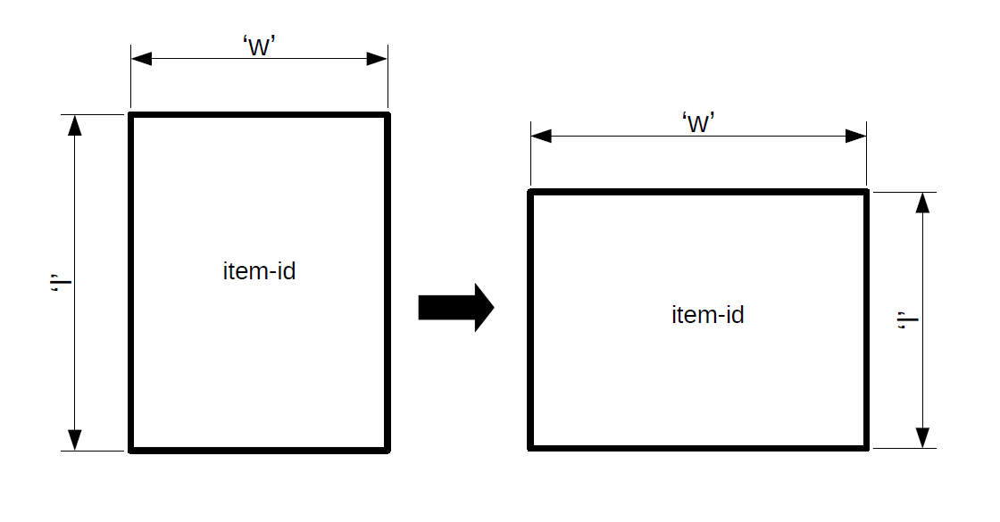

Extra methods
=============

log_solution
-------------

The ``log_solution`` method returns a formatted output of the solution found

.. code-block:: python

    >>> problem.log_solution()
    SOLUTION LOG:
    Percent total items stored : 100.0000%
    Container: container_0 60x30
            [util%] : 100.0000%
    Container: container_1 60x50
            [util%] : 91.2000%

    Remaining items : []

If a solution has not been found, the following warning message will be logged.

.. code-block:: python

    >>> problem.solution
    {}
    >>> problem.log_solution()
    No solving operation has been concluded.

---------------------------------------------------------------------------

create_figure
--------------

A figure can be created and shown/exported with

.. code-block:: python

    problem.create_figure(show=show) # show in (True, False)

The **show** parameter controls whether the figure will be opened in the default systems browser after creation.

Also be aware that if no solving operation has taken place, the following warning message will be logged.

.. code-block:: python

    >>> problem.create_figure()
    Can't create figure if a solution hasn't been found

See :ref:`here<figures_guide>` for a complete figures guide.

---------------------------------------------------------------------------

orient_items
------------

This method interchanges the width and length of the items to match
the orientation.

.. code-block:: python

    >>> items = {"item-id": {"w":1, "l":3}}
    >>> containers = {"container-id": {"W":10, "L":30}}
    >>> problem = Hyperpack(items=items, containers=containers)
    >>> problem.orient_items(orientation="wide")
    >>> problem.items
    {"item-id": {"w":3, "l":1}}

**orientation**:

    - Default value is ``"wide"``.
    - it can be ``"wide"`` or ``"long"``.
    - If another value is provided, a warning message of parameter invalidity will be logged and no orientation will take place.
    - If ``None`` is given, orientation will be skipped without message logging.

As mentioned before in hypersearch, this method changes the ``items`` orientation to match the given directive, thus causing
a reset in the ``solution`` attribute.

---------------------------------------------------------------------------

sort_items
----------

.. code-block:: python

    >>> problem.sort_items(sorting_by=("area", True))

**sorting_by**:

    - It's a tuple, whose

        - first element is the sorting criterion
        - second element a boolean for reversing the sorting. If True, then the sorting is reversed.
    - ``("area", True)`` is the default value.
    - The sorting criterion must be one of these: (``"area"``, ``"perimeter"``, ``"longest_side_ratio"``).
    - If the criterion is not one of the above, a ``NotImplementedError`` will be raised.
    - If ``None`` is given, sorting will be skipped

This method changes the ``items`` order according to the ``sorting_by`` arguments directives, thus causing
a reset in the ``solution`` attribute.
