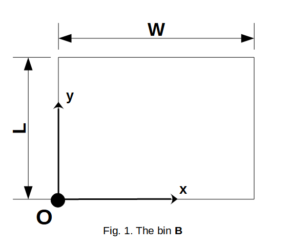
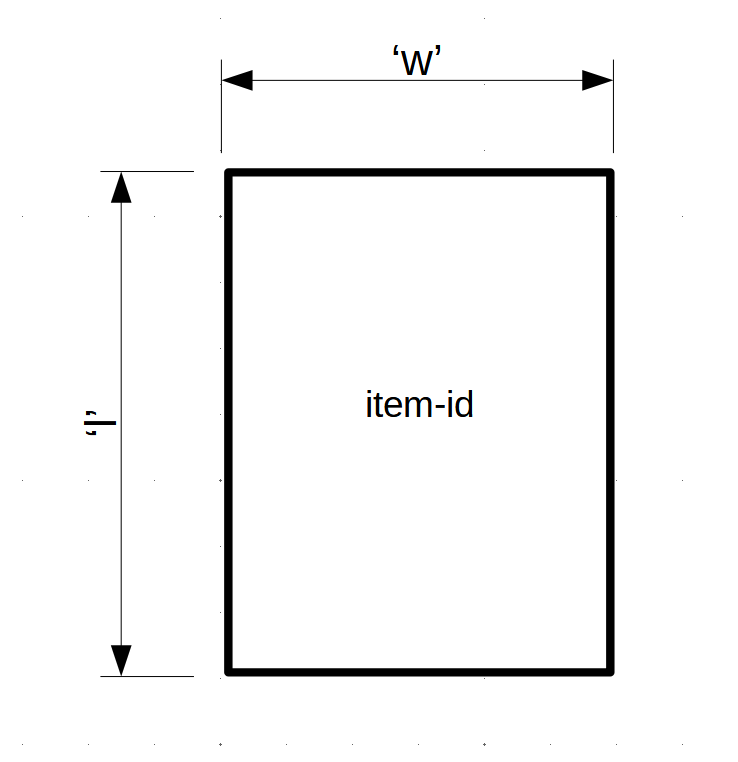

=========================
Problem/Solver parameters
=========================

Instantiation
-------------

Instantiate your problem with proper arguments

.. code-block:: python

    >>> from hyperpack import HyperPack
    >>> problem = hyperpack.HyperPack(
    >>>     containers=containers, # problem parameter
    >>>     items=items, # problem parameter
    >>>     settings=settings # solver/figure parameters
    >>> )

According to the arguments given, the corresponding problem will be instantiated, ready to be solved
with provided guidelines.

----------------------------------------------------------

Parameters
----------

containers
##########

In figure 1 the container's (bin's) coordinate system can be seen.

  - **W** is the width of the container (x coordinate).
  - **L** is the length of the container (y coordinate).

This is the ``containers`` valid structure:

.. code-block:: python

    containers = {
        "container-0-id": {
            "W": int, # > 0 container's width
            "L": int # > 0 container's length
        },
        "container-1-id": {
            "W": int, # > 0 container's width
            "L": int # > 0 container's length
        },
        # ... rest of the containers
        # minimum 1 container must be provided
    }

A ``ContainersError`` will be raised at instantiation/validation in case:
  - The containers parameter isn't a dictionary with the above structure specified.
  - There isn't at least one container in containers.
  - A container's **id** isn't a string.

A ``DimensionsError`` will be raised at instantiation/validation in case:
    - ``"W"`` or ``"L"`` values aren't positive integers.
    - ``"W"`` and/or ``"L"`` are not provided for a given container.
    - another key beside ``"W"`` or ``"L"`` is given for a container.
    - a deletion of a dimension's key ("W" or "L") is attempted.

The problem's containers after instantiation can be found in the ``problem.containers`` instance attribute:

.. code-block:: python

    >>> problem.containers
    {"container-0-id": {"W": 100, "L": 200}}

.. note::

    Each **assignement, key value change or deletion** after instantiation of the ``containers`` attribute, will **trigger**
    **validation**, and also reset the ``solution`` attribute of the instance.

    This reset affects the **figure creation** and the **solution logging**, since they
    both use the ``solution`` attribute.

    In that case if any of the above requirements aren't met, a ``ContainersError`` or ``DimensionsError``
    will be raised.

    .. code-block:: python

        >>> # after instantiation
        >>> problem.solve() # updates self.solution with solution
        >>> problem.containers = new_containers
        >>> # validation happened without error
        >>> assert problem.solution == {}
        >>>
        >>>
        >>> problem.solve() # updates self.solution with solution
        >>> problem.containers["container-id-0"] = {"W":100, "L":200}
        >>> assert problem.solution == {}
        >>>
        >>>
        >>> problem.solve() # updates self.solution with solution
        >>> problem.containers["container-id-0"]["W"] = 200
        >>> assert problem.solution == {}
        >>>
        >>>
        >>> # now an invalid containers assignment
        >>> problem.containers = {"container-id-0": {"W":-100, "L":100}}
        Traceback (most recent call last):
            ...
        hyperpack.exceptions.DimensionsError: Width and Length must be positine numbers
        >>>
        >>>
        >>> # now an invalid container key assignment
        >>> problem.containers["container-id-0"] = {"W": 100
        Traceback (most recent call last):
            ...
        hyperpack.exceptions.DimensionsError: dimensions must (only) contain Width and Length keys
        >>>
        >>>
        >>> # last an invalid Width assignment
        >>> problem.containers["container-id-0"]["W"] = 100.1
        Traceback (most recent call last):
            ...
        hyperpack.exceptions.DimensionsError: Width and Length must be positine numbers

Must be noted, that ``containers`` is not of type dict, but an instance of the ``hyperpack.structures.Containers``
class, that inherits from ``hyperpack.structures.AbstractStructure``. That is a customized dictionary with
predefined behaviour. Also each container's (and item's as we 'll see later) dimensions are an instance of
``hyperpack.structures.Dimensions`` class.

.. code-block:: python

    >>> type(problem.containers)
    <class 'hyperpack.structures.Containers'>
    >>> type(problem.containers["container-id-0"])
    <class 'hyperpack.structures.Dimensions'>

Also a string representation with ``str()`` (or implicitly with ``print()``) exists:

.. code-block:: python

    >>> print(problem.containers) # or str(problem.containers)
    Containers
      - id: container-id-0
        width: 100
        length: 100

      - id: container-id-1
        width: 200
        length: 200

----------------------------------------------------------

items
#####

The image below depicts an item's dimensions.

This is the ``items`` valid structure:

.. code-block:: python

    items = {
        "item_0_id": {
            "w": int, # > 0 item's width
            "l": int, # > 0 item's length
        },
        "item_1_id": {
            "w": int, # > 0 item's width
            "l": int, # > 0 item's length
        },
        # ... rest of the items
        # minimum 1 item must be provided
    }

An ``ItemsError`` will be raised at instantiation/validation in case:
    - The ``items`` parameter isn't a dictionary with the above specified structure.
    - There isn't at least one item in items.
    - An item's id isn't a string.

A ``DimensionsError`` will be raised at instantiation/validation in case:
    -  ``"w"`` or ``"l"`` values aren't positive integers
    - ``"w"`` and/or ``"l"`` keys are missing from a given item.
    - another key beside ``"w"`` or ``"l"`` is given for an item.
    - a deletion of a dimension's key ("w" or "l") is attempted.

The problem's items after instantiation can be found in the ``items`` instance attribute:

.. code-block:: python

    >>> problem.items
    {"item-0-id": {"w": 10, "l": 20}}

.. note::

    The assignement and value update operations of the ``items`` attribute follow the same
    behaviour as the ``containers`` attribute. Reset of the ``solution`` attribute is
    guaranteed along with structure and value validation.

Must be noted, that ``items`` is not of type dict, but an instance of the ``hyperpack.structures.Items``
class, that inherits from ``hyperpack.structures.AbstractStructure``. That is a customized dictionary with
predefined behaviour. Also each item's dimensions are an instance of
``hyperpack.structures.Dimensions`` class.

.. code-block:: python

    >>> type(problem.items)
    <class 'hyperpack.structures.Items'>
    >>> type(problem.items["item-0-id"])
    <class 'hyperpack.structures.Dimensions'>

Also a string representation with str() exists:

.. code-block:: python

    >>> print(problem.items) # or str(problem.items)
    Items
      - id: item-id-0
        width: 1
        length: 2

      - id: item-id-1
        width: 2
        length: 3

----------------------------------------------------------

.. _settings_param:

settings
########

This is the ``settings`` valid structure:

.. code-block:: python

    settings = {
        "workers_num": int,
            # (> 0) the number of processor threads for hypersearch
            # defaults to 1 if omitted

        "max_time_in_seconds": int,
            # (> 0) the max time for solving
            # defaults to 60

        "rotation": bool ,
        # if item rotation is enabled
        # defaults to True

        # figure key can be omitted
        "figure": {

            "export": {
                "type": str,
                    # "image" or "html"
                "format": str,
                    # "pdf", "png", "jpeg", "webp", "svg"
                    # unecessary if html exportation
                "path": "abs/path/to/figure/directory",
                    # must be valid system absolute path
                "file_name": str,
                    # "PlotlyGraph" default value
                    # if file_name given, it must match the
                    # r"^[a-zA-Z0-9_-]{1,45}$" regex
                "width": int,
                    # (> 1) pixels number (default 1700px)
                "height": int,
                    # (> 1) pixels number (default 1700px)
            },

            "show": bool,
                # if the figure will be shown when create_figure is called
                # if omitted, falls back to create_figure's
                # 'show' kwarg (default False)
        }
    }

The problem's settings after instantiation can be found in the ``settings`` instance attribute:

.. code-block:: python

    >>> problem.settings
    {"workers_num":2, "rotation": False}

If ``settings`` parameter is omitted, then settings default to the empty dictionary, but a
default value is assigned for ``workers_num``, ``max_time_in_seconds`` and ``rotation`` attributes (see below).

.. code-block:: python

    >>> problem = HyperPack(items=items, containers=containers)
    >>> problem.settings
    {}

The ``workers_num``, ``max_time_in_seconds`` and ``rotation`` are private attributes and should
be changed/set through the settings attribute.

There are two ways of changing already instantiated settings:
    **A.** New assignment of settings:

        .. code-block:: python

            >>> problem.settings = new_settings
            >>>  # new settings have been validated and applied

    **B.** Changing a key/value of settings. In this case no validation takes place
    and no settings will be applied automatically. **User must do explicit validation like this**:

        .. code-block:: python

            >>> problem.settings["workers_num"] = 3 # no validation happened
            >>> # workers_num setting hasn't been changed
            >>> problem.validate_settings() # manually validate and apply settings
            >>>  # new settings have been validated and applied

The below interactive session covers the behaviour:

.. code-block:: python

    >>> # after problem instantiation
    >>> problem.settings = new_settings # new assignment
    >>> # on the background problem.validate_settings() was called
    >>> # doing validation and attributes setting
    >>>
    >>> problem.settings["workers_num"] = 3 # no validation happened
    >>> # workers_num settings hasn't been changed
    >>> problem.validate_settings() # manually validate and apply settings
    >>>
    >>> # in case a wrong settings is given
    >>> problem.settings["workers_num"] = -3
    >>> problem.validate_settings() # manually validate
    Traceback (most recent call last):
        ...
    hyperpack.exceptions.SettingsError: workers_num multi process setting must be positive integer

.. note::

    ``solution`` attribute **will not be reset** in settings re-assignment.

Below are the detailed ``workers_num``, ``max_time_in_seconds``, ``rotation``, ``figure`` settings keys.

workers_num
***********

When settings ``"workers_num"`` is given, and is above 1, then a multiprocessing search will be deployed
when :ref:`hypersearch<hypersearch>` is used.

In that case, a **safe guarding of the main module** is needed, if execution is made in windows
environment, as stated in the `standard library`_.

.. code-block:: python

    # in main execution module
    # safe guarding
    # only in windows OS systems
    if __name__ == "__main__":
        problem.hypersearch()

.. _`standard library`: https://docs.python.org/3/library/multiprocessing.html

If a number greater than 1 is given a warning message will be logged:

.. code-block:: python

    >>> problem.settings["workers_num"] = 2
    >>> problem.validate_settings()
    In Windows OS multiprocessing needs 'Entry point protection'
    which means adding if '__name__' == '__main__'
    before multiprocessing depending code execution

If the value of the key is not a positive integer, a ``SettingsError`` will be raised
with appropriate message.

.. code-block:: python

    >>> problem.settings["workers_num"] = -1
    >>> problem.validate_settings()
    Traceback (most recent call last):
        ...
    hyperpack.exceptions.SettingsError: workers_num multi process setting must be positive integer

.. note::

    If not provided, the default value will be 1 (no multiprocessing). The default value is a class
    attribute constant named ``WORKERS_NUM_DEFAULT_VALUE``. Subclassing ``HyperPack`` and overriding
    can change default behaviour.

If a number of workers greater than the number of procesor threads is given, an warning message will
be logged: ``you are trying to set more workers than your cpu threads``

.. code-block:: python

    >>> problem.settings["workers_num"] = 10**10 # maybe valid in 2123 A.D.
    >>> problem.validate_settings()
    you are trying to set more workers than your cpu threads

Errors while solving in multiprocess mode:
    **If one process fails:** the system remains functional, but an error will be logged that
    ``Some of the processes raised an exception. Please check logs``.

    **If all the processes fail:** a ``MultiProcessError`` will be raised with an
    ``All processes failed. Check logged errors`` message.

Beware, error logging from multiple processes to a file is a `special case`_.

.. _`special case`: https://docs.python.org/3/howto/logging-cookbook.html#logging-to-a-single-file-from-multiple-processes

max_time_in_seconds
*******************

This value governs the maximum allowed time for solving before exiting and returning the best found solution.
When using hypersearch it is essential for time constrained operations to set this value appropriately.

.. note::

    If not provided, the default value will be 60. The default value is a class
    attribute constant named ``MAX_TIME_IN_SECONDS_DEFAULT_VALUE``. Subclassing and overriding can change default behaviour.

rotation
*********

This value enables or disables the rotation of items if they dont fit with their current orientation.

.. note::

    If not provided, the default value will be True. The default value is a class
    attribute constant named ``ROTATE_DEFAULT_VALUE``. Subclassing and overriding can change default behaviour.

figure
*******

The settings that govern figure operations can be found :ref:`here<Figures>`
