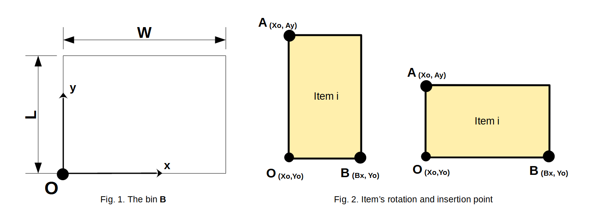
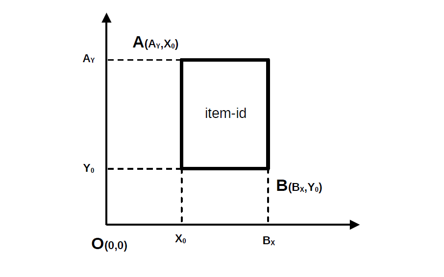

Solution structure
==================

.. _solution_structure:

Below is the structure of the solution:

.. code-block:: python

    problem.solution = {
        "container-0-id": {
            "item_id": [
                Xo, # item's X coordinate of the origin's placement
                Yo, # item's Y coordinate of the origin's placement
                w,  # item's width
                l,  # item's length
                # item's w, l will be interchanged
                # if the item was rotated while solving
            ],
            "item_id": [Xo, Yo, w, l],
            # ...
        },

        "container-1-id" : {
            "item_id": [Xo, Yo, w, l],
            "item_id": [Xo, Yo, w, l],
            # ...
        },

        # all the containers
    }

The insertion point and the bin's and item's coordinate system can be seen here:

Please keep in mind, that **origin** of an item is it's bottom left corner. Thus Xo, Yo are the coordinates
of the item's origin in the solution space (bin's coordinates).

.. warning::

    Be aware that the ``solution`` attribute is a mutable object. Creating a pointer on that object
    and making changes on the pointer will reflect on the ``solution`` attribute.
    Deepcopying that object is the safe way in this situation.
